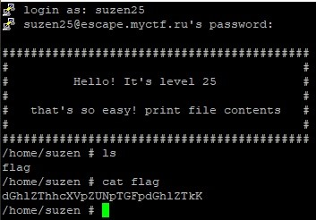
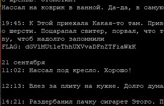

## Лабораторная работа 1  
## Пакин Андрей Сергеевич ББСО-01-18  

1 Воспользовался cat для отображения файла  
ls для отображения содержимого каталога  
ZGFpejZhaFJhZVNhZXhhaWJ1YWYK  
 

2 Использовал cat ./* - для отображения всей информации  
dGhlaWxpM2FoWm9odGFpM2VldzMK  
 

3 Сначала ls, т.к. кроме листа нет команд, прочитал построчно нужный файл в директории  
whileread $LINE; doecho $LINE; done<./-diary.txt-;  
Y284ZWlxdXVlMmllTDNpZXBoNWUK  
 

14 cd перемещение по каталогам  
cd .. - на позицию вверх  
d2FodmFoMWFlV2FpYmVlaG9vMmIK  
 

15 Чтобы понять где мы находимы – использовалpwd (presentworkingdirectory - текущий рабочий каталог)  
TWVlMXdvaDJ6YWVoZWoyamllNm8K  
 

16 id - показывает информацию о user'е  
ZXVsb29naG91MFBob2g4T2hkYWkK  
 

17 Так как у нас скрытый файл, то нужно делать через:  
ls -a который выводит скрытые файлы  
bmVlNm1lMEhhaU11M2thaGVpNmEK  
 

18 mandiary - чтобы получить руководство по diaryв flagпароль  
Y2hpZWNoM2VpRzRJZWtlaXNlbGUK  
 

19 mkdir - создание директории  
mkdir -p - создание сразу нескольких вложенных  
cd - переходим в директории для создания следующей  
V2VpMGNvaHNoZWlxdWE0YWhnaG8K  
 

20 rm -R (рекурсивное удаление директории и всех вложенных директорий)  
YW1pZWhpaW0yb2h5NW9vRjZlaXcK  
 

21 rm *[0-9]*.txt  
rm *[a-z]*.png  
rm test-*.log (удаляем все не архивированные)  
(Используем rmдля удаления файлов); ls  
aWU0b29XdWxlaXBodXBpZWZveW8K  
   
 
 

22 Цикл и touch для создания файла  
# i=1; while [ $i -lt 999 ];dotouch $i.txt;let i++;done;  
touch - создает файл, let i++ увеличивает счетчик на единицу. -lt == <;  
dXI2dXNhaDNvaFQxaWV2MGNobzgK  
 
 
 

23 Использовали ls / cd и mv (для перемещения и изменения названия каталога/файла)  
dmVlc2VpQzVBb2dlaXI1cmVlM2YK  
 

24 Использовал ls, cd и cp -r (для копирования каталога)  
YWVnaG9venVvejd2b292OHNvaEwK  
   

25 Воспользовалсяls и cat  
dGhlZThhcXVpZUNpTGFpdGhlZTkK  
 

26 Использовали less для отображения содержимого файла по страницам  
После использовали /SECOND, /THIRD для поиска флага  
WWVpc2gxYWlndXVrZWl5ZWloaWUK  
  
 
 
 

27 tail -f diary, выводим строки с конца (благодаря -fобновляется информации по мере появления новых строк в файле)  
dGVlMUtleThhUXVvaDFnZTFiaWkK  

 
28 cat<<EOF>diary  
<ввод текста без последней строки>  
EOF  
echo -n "11:32pm: Нассал под кресло. Еееееееее!" >>diary – для решени проблем непечатных знаков  
ZWV4b1g1WnVkMm9oZnVjYWhkdTMK    
29 Жмём стрелочку вверх для того чтобы узнать историю    
dmFvbmcwcGFlMWlodUJvaFppZWQK    
 
